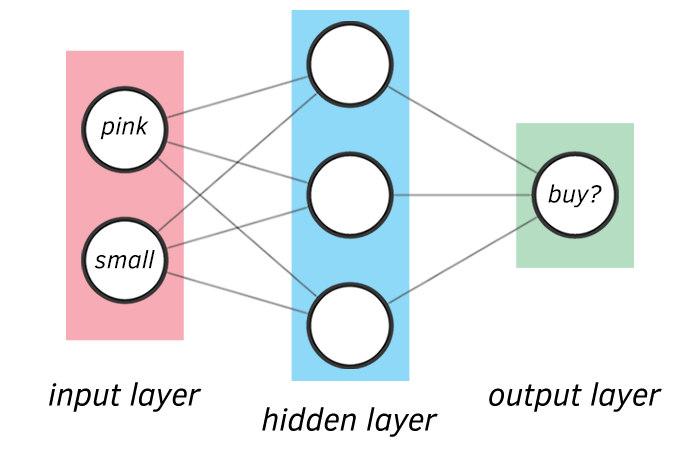

## Una Rete Neurale semplice con Python e Tensorflow
Voglio valutare in base alle mie preferenze se acquistare uno dei nuovi computer che il negoziante della mia città ha messo in offerta.
Per prendere la giusta decisione sfrutterò le reti neurali, python e una libreria pensata per il machine learning: tensorflow.

> _Per la stesura di questo progetto didattico mi sono ispirato all'articolo_ [Build a simple Neural Network with TensorFlow.js | Deep Learning for JavaScript Hackers](https://curiousily.com/posts/build-a-simple-neural-network-with-tensorflow-js/) di [Venelin Valkov](https://curiousily.com/posts/build-a-simple-neural-network-with-tensorflow-js/)


### Come ho risolto il problema

Ho creato un dataset con le caratteristiche dei computer (colore, dimensioni) e come etichetta le mie preferenze (lo comprerei, non lo comprerei) e ho allenato il modello con il metodo di apprendimento supervisionato.

Ho rappresentato le caratteristiche dei computer in vendita in una matrice di 9 righe e 2 colonne.
Le colonne rappresentano le caratteristiche del computer in relazione a colore (col.1) e dimensioni (col.2), 
le righe ovviamente rappresentano i computer esaminati per costruire il dataset.

```
dataset =
 [0.1,  0.1 ]
 [0.3,  0.3 ]
 [0.5,  0.6 ]
 [0.4,  0.8 ]
 [0.9,  0.1 ]
 [0.75, 0.4 ]
 [0.75, 0.9 ]
 [0.6,  0.9 ]
 [0.6,  0.75]
```

Quindi ho rappresentato la scelta se comprare o no in base alle caratteristiche con un numero binario: per ogni riga della matrice, 0 se non lo comprerei, 1 se lo comprerei.

Ed ecco la matrice unidimensionale che rappresenta le mie scelte:
```
labels = [0, 0, 1, 1, 0, 0, 1, 1, 1]
```

## Progettazione della rete neurale

2 layer network (non consideriamo in questo caso il layer di input)

  * 1° layer: 3 neuroni
  * 2° layer: 1 neurone

Le funzioni di attivazione sono:
  * 1° layer: ReLu
  * 2° layer: softmax

Perché ho scelto queste funzioni di attivazione?
    
### ReLu
La funzione di attivazione ReLU (Rectified Linear Unit) è definita come la funzione max(0,x), dove x è l'input della funzione. 

In altre parole, se l'input è positivo, la funzione restituisce l'input stesso, altrimenti restituisce 0. La funzione ReLU è comunemente utilizzata come funzione di attivazione nei layer nascosti delle reti neurali, poiché è semplice da calcolare e ha dimostrato di essere efficace nella risoluzione di problemi di classificazione e regressione.

### softmax
La funzione di attivazione softmax è utilizzata per trasformare un vettore di valori in un altro vettore di valori normalizzati, in modo che la somma di tutti i valori del nuovo vettore sia uguale a uno.
Questa funzione è spesso utilizzata nell'ultimo strato di una rete neurale per produrre una distribuzione di probabilità su un insieme di classi. In altre parole, la funzione softmax viene utilizzata per calcolare le probabilità di appartenenza di un input a ciascuna delle classi possibili.

## Python e tensorflow
La rete neurale è stata implementata in python utilizzando la libreria tensorflow.



Ho usato il `binary crossentropy` per misurare la qualità dei pesi e parametri del nostro modello misurando quanto sono "buone" le previsioni.
Infine ho cercato i "pesi" che minimizzassero l'errore della rete neurale.

L'ho fatto tramite l'algoritmo `Stochastic gradient descent` e in particolare attraverso l'implementazione `Adam optimizer`, un algoritmo di ottimizzazione che utilizza la stima dell'andamento della funzione di costo per aggiornare i pesi della rete neurale.

## Risultati
```
Epoch 1/10000
1/1 [==============================] - 1s 547ms/step - loss: 0.8109 - accuracy: 0.0000e+00
Epoch 2/10000
1/1 [==============================] - 0s 3ms/step - loss: 0.7638 - accuracy: 0.5556
Epoch 3/10000
1/1 [==============================] - 0s 2ms/step - loss: 0.7362 - accuracy: 0.5556
...
Epoch 32/10000
1/1 [==============================] - ETA: 0s - loss: 0.2597 - accuracy: 1.0000
Reached 90% accuracy so cancelling training!
1/1 [==============================] - 0s 3ms/step - loss: 0.2597 - accuracy: 1.0000
1/1 [==============================] - 0s 65ms/step
Probability of buying:  0.893912
````

In circa 30 iterazioni sono riuscito a raggiungere una precisione oltre il 90% e quindi ho deciso di fermare l'allenamento.
La probabilità che io acquisterei il computer con le caratteristiche che ho specificato `[color=0.1/1, size=0.6/1]` è del 89%.

## Conclusioni

Ho utilizzato Python e tensorflow per creare una rete neurale che mi permette di valutare se acquistare o meno un computer in base alle mie preferenze.
Con questo semplice esercizio ho avuto modo di applicare i concetti di machine learning e di neural network appresi durante il corso di Reti Neurali: le funzioni di attivazione, il backpropagation, l'ottimizzazione dei pesi e parametri, ecc. 


